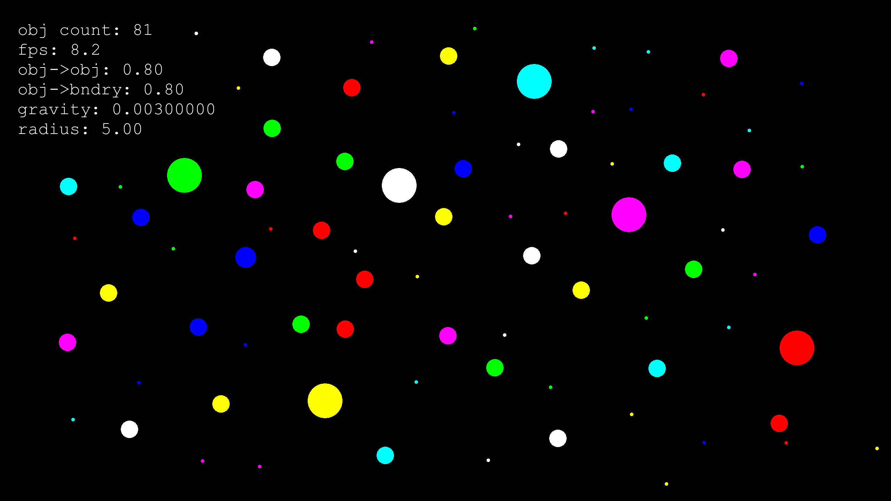

# Fizz
A colorful bouncing ball simulator with high reproducibility and configurable physics parameters

[](https://www.youtube.com/watch?v=2Ld3AF5m-Y8)
See the [video demo](https://www.youtube.com/watch?v=2Ld3AF5m-Y8)

Performs broad-phase collision detection using the sweep and prune algorithm on axis-aligned bounding boxes.

The force of gravity, coefficients of restitution (that is, the bounciness of the objects) and the ball radii are configurable.

SFML is used for graphics display.

The project was built in Visual Studio 2019.

The following .dll files are required:
```
openal32.dll
sfml-audio-2.dll
sfml-audio-d-2.dll
sfml-graphics-2.dll
sfml-graphics-d-2.dll
sfml-network-2.dll
sfml-network-d-2.dll
sfml-system-2.dll
sfml-system-d-2.dll
sfml-window-2.dll
sfml-window-d-2.dll
```

And the font files:
```
cour.ttf
courbd.ttf
```