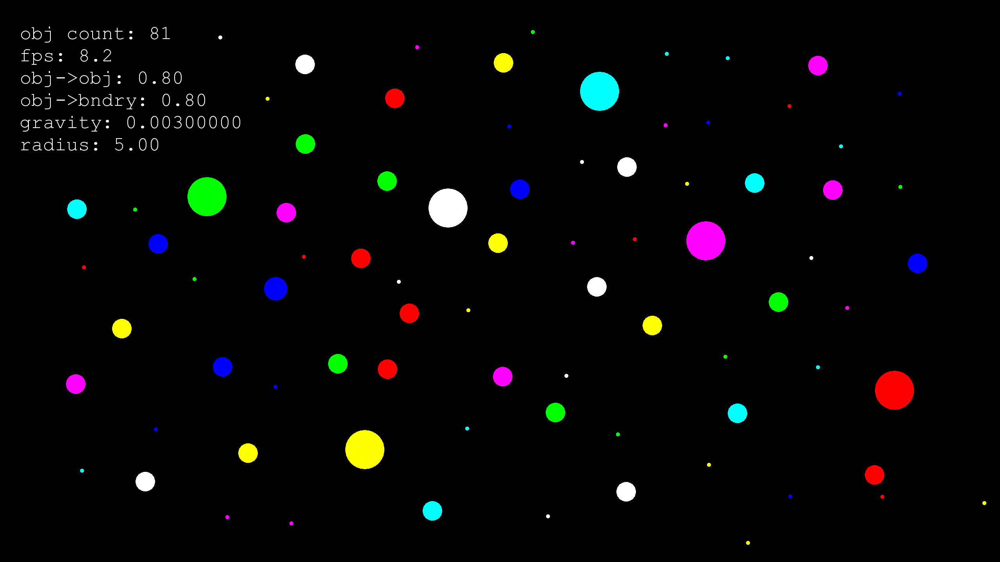

# Fizz
A colorful bouncing ball simulator with high reproducibility and configurable physics parameters

[](https://www.youtube.com/watch?v=2Ld3AF5m-Y8)
See the [video demo](https://www.youtube.com/watch?v=2Ld3AF5m-Y8)

Performs broad-phase collision detection using the sweep and prune algorithm on axis-aligned bounding boxes.

The force of gravity, coefficients of restitution (that is, the bounciness of the objects) and the ball radii are configurable.

[SFML](https://www.sfml-dev.org/) is used for graphics display.

The project was built in Visual Studio 2019.

# Controls
- Quit the simulation using the 'q' key
- Enable/disable gravity using the 'g' key
- Add an object by clicking on the screen
- Fire an object with an initial velocity by pressing 'f', and clicking then dragging on the screen, then clicking again
- Add a stream of objects by holding 's' and dragging the mouse
- Enable/disable the top wall using the 't' key
- Pause/unpause simulation using the 'p' key
- Reset all objects to their initial position using the 'r' key
- Show/hide physical constants and current fps using the 'h' key

# Configuring physical constants
The constants for gravity and coefficients of restitution can be edited via the configuration box.

1. Open the box by typing 'shift-;'

2. Then type 'param value', such as 'g 0.002' to change the value of a parameter

Available parameters:

- g - constant of gravitational acceleration
- rad - radius of circle objects to be inserted
- ob - object-to-object coefficient of restitution 
- bo - boundary-to-object coefficient of restitution

# Building the project
The project was built in Visual Studio 2019.

The following .dll files are required:
```
openal32.dll
sfml-audio-2.dll
sfml-audio-d-2.dll
sfml-graphics-2.dll
sfml-graphics-d-2.dll
sfml-network-2.dll
sfml-network-d-2.dll
sfml-system-2.dll
sfml-system-d-2.dll
sfml-window-2.dll
sfml-window-d-2.dll
```

And the font files in assets/fonts folder:
```
cour.ttf
courbd.ttf
```